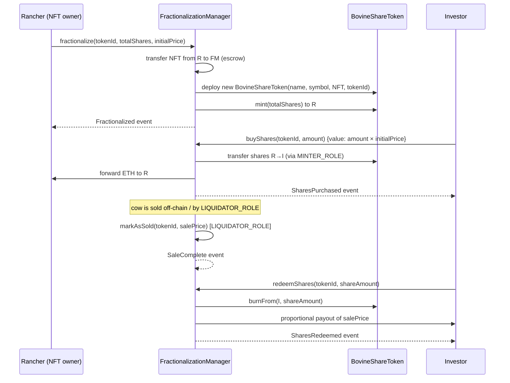
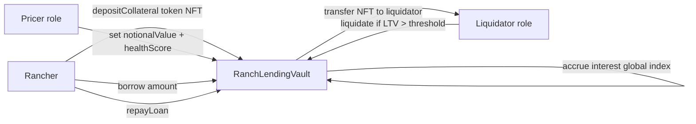
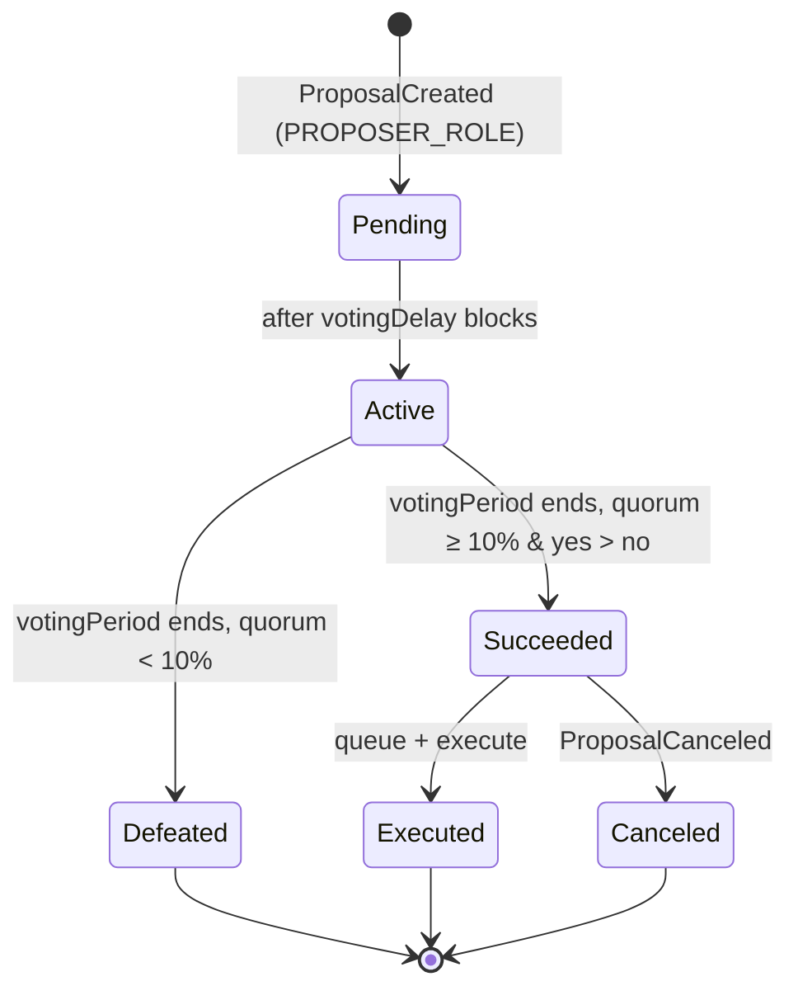

# ranch_ledger — Architecture

> **Status:** `v3.0.0` (Solidity 0.8.28, Foundry, OpenZeppelin v5.1)
> **Last updated:** 2026-07-05
> **Audience:** Solidity / DevOps / rancher-developers onboarding to the project.

---

## 1. What this project does

`ranch_ledger` is a **permissionless, EVM-native cattle lifecycle ledger**. Every animal is represented as a unique on-chain entity that can be:

- identified uniquely (an ERC-721 NFT)
- enriched with a full life history (vaccines, movements, feed, health exams, abattoir processing)
- rewarded via an ERC-20 utility token for completing lifecycle events
- queried by any third party (consumer, regulator, banker) without asking the original registry
- **fractionalized** — an NFT can be split into per-cow ERC-20 share tokens, sold to investors, and redeemed proportionally after a sale
- **used as collateral** — an NFT can be deposited into a lending vault to borrow against the animal's notional value, with compound-style interest and liquidation
- **governed on-chain** — a DAO (`GovernorRanch`) lets token holders propose, vote on, and execute protocol changes
- **identified globally** — beyond Brazil's SISBOV, the ledger validates national livestock IDs for the EU, USA, Australia, China, the GCC, and any country with a known ID scheme

The goal is to give smallholder ranchers in any jurisdiction a **public, composable, EUDR-ready provenance record** for each animal they raise — without paying for an enterprise contract, without a SaaS lock-in, and without trusting a centralized database.

---

## 2. Why it exists

The on-chain ledger is the system of record. The off-chain Express + MongoDB service is a **CRUD index** over the same data, with rollback on chain failure. This split mirrors how Walmart + IBM Food Trust operated, but with two crucial differences:

1. **No permissioning.** Anyone with a wallet can query, fork, and run their own copy.
2. **No per-record fee at the user layer.** The on-chain fee is paid by the actor (the rancher) when they call a function. The off-chain API is free.

The current release (`v3.0.0`) is a working Foundry + Solidity 0.8.28 codebase with:

- 17 Solidity tests, all passing
- 100 simulated agents that each registered one bovine on a local anvil chain
- A REST API (Express + mongoose + ethers v6) that bridges the on-chain data with a familiar CRUD interface
- **10 smart contracts** covering the lifecycle ledger, identity NFT, reward token, EUDR compliance, GPS validation, NFT-backed lending, fractionalization, per-cow share tokens, and DAO governance
- **Global livestock ID support** for Brazil (SISBOV), the EU, USA, Australia, China, and the GCC
- **DeFi primitives** (lending vault + fractionalization) that turn bovine NFTs into liquid, composable assets
- **On-chain governance** via a Governor-based DAO

---

## 3. Smart contract surface

The protocol is composed of **10 contracts** in `src/`. They fall into four layers:

| Layer | Contracts |
|---|---|
| Ledger & identity | `BovineTracking`, `BovineNFT`, `RanchToken` |
| Compliance & location | `EUDRCompliance`, `GPSValidator` |
| DeFi | `RanchLendingVault`, `FractionalizationManager`, `BovineShareToken` |
| Governance | `GovernorRanch` |

### 3.1 `BovineTracking.sol` — the ledger

Access-controlled lifecycle ledger. Inherits `AccessControl` + `ReentrancyGuardTransient` (transient storage reentrancy guard, cheaper than persistent storage). Uses `uint64` struct packing for gas savings on nested arrays.

**Roles (OpenZeppelin AccessControl):**

| Role constant | Granted to | Can call |
|---|---|---|
| `DEFAULT_ADMIN_ROLE` | Deployer (multi-sig in production) | Grant/revoke other roles, set NFT receiver |
| `REGISTRAR_ROLE` | Farm / cooperative | `addBovine` |
| `VET_ROLE` | Veterinarian | `addVaccine`, `addHealthExam` |
| `RANCHER_ROLE` | Ranch hand | `addMovement`, `addFeed` |
| `ABBATTOIR_ROLE` | Slaughterhouse | `addAbattoirProcess` |

**Storage layout** — EIP-7201 namespace constants are declared as unused constants (an EIP-7201 migration was attempted but reverted to simple storage because value types like `uint64` don't work with assembly slot assignment — see `docs/EIP7201_IMPLEMENTATION.md`):

```
Bovine struct:
  uint256 id
  string  name
  uint256 age
  string  breed
  string  location
  address owner
  string  countryCode        // global livestock ID support
  string  nationalId         // e.g. SISBOV, USDA ANID, NLIS
  string  earTag             // physical ear tag
  Vaccine[]           vaccines
  Movement[]          movements
  Feed[]              feeds
  HealthExam[]        healthExams
  AbattoirProcess[]   abattoirProcesses

Mappings:
  uint256 => Bovine                  _bovines
  string  => uint256                 _bovineIdByName
  string  => EnumerableSet.UintSet   _bovineIdsByBreed
  string  => EnumerableSet.UintSet   _bovineIdsByLocation
  EnumerableSet.UintSet              _bovineIds
  uint256                            totalBovines
  address                            nftReceiver
```

**Errors (custom, gas-efficient):**

```solidity
error InvalidBovine(uint256 id);
error DuplicateBovineName(string name);
error EmptyString(string field);
error InvalidAge(uint256 age);
```

**Events:**

```solidity
event BovineAdded(uint256 indexed id, string name, uint256 age, string breed, string location, address indexed owner);
event VaccineAdded(uint256 indexed bovineId, string name, uint256 date);
event MovementAdded(uint256 indexed bovineId, string fromLocation, string toLocation, uint256 date);
event FeedAdded(uint256 indexed bovineId, string foodType, string origin, uint256 quantity, uint256 date);
event HealthExamAdded(uint256 indexed bovineId, string examType, string result, uint256 date);
event AbattoirProcessAdded(uint256 indexed bovineId, string abattoir, uint256 abattoirDate, string processing, uint256 date);
```

### 3.2 `BovineNFT.sol` — the per-animal identity

`ERC721` from OpenZeppelin v5.1 with `ERC721Consecutive` for batch minting. Constructor calls `ERC721("BovineNFT", "BOVN")` directly.

- `mintForBovine(address to, uint256 bovineId)` — single mint, `MINTER_ROLE` only
- `mintBatchForBovines(address to, uint256[] calldata bovineIds)` — batch mint with ~85% gas savings per token vs. single mint
- `bovineToToken[uint256] => uint256` (1:1 mapping to enforce one NFT per animal)
- `tokenToBovine[uint256] => uint256` (reverse lookup)
- `setBaseURI(string)` — admin-only, points to metadata (default `ipfs://bovine/`)
- `tokenURI(uint256) => string` — returns `baseURI + tokenId`
- `supportsInterface` override uses `override(ERC721, AccessControl)`

**Roles:** `MINTER_ROLE` (granted to `BovineTracking` or the deployer).

The NFT is intentionally minimal: it links an on-chain token to a bovine id, and the actual lifecycle data lives in `BovineTracking`. This separation means the NFT stays cheap (ERC-721) while the rich data structure can be upgraded without redeploying the NFT.

### 3.3 `RanchToken.sol` — the reward / utility ERC-20

Standard `ERC20` from OpenZeppelin v5.1 with:

- `mint(address to, uint256 amount)` — `MINTER_ROLE` only
- `burn(uint256 amount)` — anyone can burn their own
- Custom `decimals()` (6, by design — for sub-cent rewards)
- AccessControl inheritance (so the same admin that governs `BovineTracking` can govern the token)

In the roadmap this token is repurposed from "reward" to "rural credit governance" — see `docs/ROADMAP.md` §6.

### 3.4 `EUDRCompliance.sol` — EUDR metadata & global livestock ID validators

Stores EUDR (EU Deforestation Regulation) attestation metadata and validates national livestock IDs for **all major global ID systems**.

**Structs:**

```solidity
struct EUDRMetadata {
    string  sisbovId;             // Brazil SISBOV
    string  cnpj;                 // farm CNPJ
    uint256 birthTimestamp;
    string  deforestationCertHash;
    GeoPolygon farmPolygon;
}

struct NationalLivestockId {
    string  countryCode;          // ISO 3166-1 alpha-2
    string  nationalId;           // country-specific ID
    string  earTag;               // physical ear tag
    uint256 timestamp;
}

struct GeoPolygon {
    int256[4] latE7;               // 4 corners, lat × 10^7
    int256[4] longE7;              // 4 corners, long × 10^7
}
```

**Validators:**

| Function | Country / region | Rule |
|---|---|---|
| `validateSisbovId` | Brazil | 15-digit numeric |
| `validateEUId` | European Union | 9–12 chars: country code + herd mark + individual ID |
| `validateUSDAAnid` | USA | 15-digit numeric (USDA Animal ID) |
| `validateUSDEid` | USA | 9-digit (USDA EID tag) |
| `validateNLIS` | Australia | 12-digit numeric (National Livestock Identification) |
| `validateChinaId` | China | 15-digit numeric |
| `validateGCCId` | Gulf (GCC) | 14 chars: `CC-XXXXXX-XXXX` |
| `validateNationalId` | Dispatch | Routes by `countryCode` to the correct validator |

**Event:** `EudrAttestations(uint256 indexed bovineId, string countryCode, string nationalId, uint256 timestamp)`.

See §9 below for the global ID coverage table.

### 3.5 `GPSValidator.sol` — GPS coordinate validation

Validates GPS coordinates attached to bovine movements. Functions are `view` (not `pure`) because they read `block.timestamp` for freshness checks.

**Struct:**

```solidity
struct GPSCoordinate {
    int256  latE7;        // latitude  × 10^7 (range: ±900_000_000)
    int256  longE7;       // longitude × 10^7 (range: ±1_800_000_000)
    uint256 timestamp;   // when the reading was taken
}
```

**Validation rules:**

- Lat/long bounds: ±90° / ±180° × 10⁷
- Timestamp freshness: reading must be < 24 h old (via `block.timestamp`)
- Movement sanity: if two readings are < 1 min apart, the distance must be < 1 km

`calculateDistance()` uses the **Haversine formula** on the E7-encoded coordinates.

**Event:** `MovementGPS(uint256 indexed bovineId, int256 latE7, int256 longE7, uint256 timestamp)`.

### 3.6 `RanchLendingVault.sol` — NFT-backed lending vault

NFT-backed lending vault. Inherits `AccessControl` + `ReentrancyGuardTransient`. See `docs/RANCH_LENDING_VAULT_DESIGN.md` for the full design.

**Roles:** `LIQUIDATOR_ROLE`, `PRICER_ROLE`.

**Structs:**

```solidity
struct Collateral {
    address owner;
    uint256 tokenId;
    string  countryCode;
    string  nationalId;
    uint256 notionalValue;   // set by PRICER_ROLE
    uint256 healthScore;      // 0–100
    bool    isCollateralized;
}

struct Loan {
    uint256 principal;
    uint256 interestAccrued;
    uint256 lastUpdateBlock;
    bool    isActive;
}

struct VaultConfig {
    uint256 maxLTV;                // e.g. 70%
    uint256 liquidationThreshold;   // e.g. 80%
    uint256 healthScoreFloor;       // minimum health score to accept
    uint256 baseBorrowRate;         // base APR
    uint256 utilizationSlope1;      // below optimal
    uint256 utilizationSlope2;      // above optimal
    uint256 optimalUtilization;     // kink point
}
```

**Functions:** `depositCollateral`, `withdrawCollateral`, `borrow`, `repayLoan`, `liquidate`.

Interest is **compound-style** with a global index that accrues per-block. See §11 for the architecture overview and `RANCH_LENDING_VAULT_DESIGN.md` for the full rate model.

**Events:** `CollateralDeposited`, `CollateralWithdrawn`, `LoanRepaid`, `Liquidated`, `InterestAccrued`.

### 3.7 `FractionalizationManager.sol` — NFT fractionalization

Splits a bovine NFT into per-cow ERC-20 share tokens. Inherits `AccessControl` + `ReentrancyGuardTransient`.

**Roles:** `ADMIN_ROLE`, `LIQUIDATOR_ROLE`.

**Struct:**

```solidity
struct Fractionalization {
    address owner;              // original NFT holder
    uint256 totalShares;        // total ERC-20 shares minted
    uint256 initialPrice;       // price per share (wei)
    bool    isFractionalized;
    uint256 salePrice;           // set when the cow is sold
    bool    isSold;
}
```

**Functions:**

| Function | Caller | Effect |
|---|---|---|
| `fractionalize` | NFT owner | Transfers NFT to manager, deploys a `BovineShareToken`, mints shares to owner |
| `buyShares` | Anyone (payable) | Buy shares with ETH at `initialPrice` |
| `redeemShares` | Share holder | Proportional payout from the sale proceeds |
| `markAsSold` | `LIQUIDATOR_ROLE` | Sets `salePrice` and `isSold`, enabling redemption |

**Mappings:** `tokenToShareContract` (NFT tokenId → share token address), `shareContractToTokenId` (reverse).

**Events:** `Fractionalized`, `SharesPurchased`, `SharesRedeemed`, `SaleComplete`.

See §10 for the fractionalization flow diagram.

### 3.8 `BovineShareToken.sol` — per-cow ERC-20 share token

A dedicated ERC-20 deployed per fractionalized cow. Constructor takes `name_`, `symbol_`, `_underlyingNft`, `_tokenId`.

- `MINTER_ROLE` for minting (granted to `FractionalizationManager`)
- `burnFrom()` for redemption (called by the manager when a holder redeems)
- Immutable references to the underlying NFT contract and tokenId, so share holders can always verify which cow their shares represent

### 3.9 `GovernorRanch.sol` — DAO governance

On-chain governance. Inherits `Governor` + `GovernorVotes` + `AccessControl` from OpenZeppelin v5.1. See `docs/DAO_GOVERNANCE_DESIGN.md` for the full design.

**Roles:** `PROPOSER_ROLE`, `VOTER_ROLE`.

**Key implementation notes:**

- Uses immutable `_votingDelay` and `_votingPeriod` (OZ v5.1.0 doesn't expose `_setVotingDelay`, so they are set in the constructor and cannot change)
- Custom `_votesCast` mapping for `hasVoted()` tracking
- `supportsInterface` override uses `override(Governor, AccessControl)`
- **10% quorum**
- `getVotes` uses `balanceOf()` (simplified — not `getPastVotes`)
- `ProposalDetails` struct tracks `yesVotes`, `noVotes`, `abstainVotes`

**Events:** `ProposalCreated`, `VoteCast`, `ProposalExecuted`, `ProposalCanceled`.

See §12 for the governance architecture.

---

## 4. Off-chain service

```
Express server (server.js)
  ├── /POST   /bovines              addBovine (Mongo first, then chain; rollback on chain fail)
  ├── /POST   /bovines/:id/vaccine addVaccine
  ├── /POST   /bovines/:id/movement addMovement
  ├── /GET    /bovines/:id          getBovine (chain only)
  └── /GET    /health               contract address sanity check

services/bovineService.js
  └── reads ABIs from out/BovineTracking.sol/BovineTracking.json
      (canonical ABI source - never hand-write tuple types)
```

Key invariants:

1. The on-chain contract is the **source of truth**. The Mongo write is a cache.
2. If the chain call fails, the Mongo write is rolled back. (Best-effort; if the process dies between the two, the cache drifts — see `ROADMAP.md` §8.)
3. ABIs are loaded from the Foundry build artifact (`out/`), not hand-written. This avoids the `tuple` ABI parsing trap.

---

## 5. Deployment topology

### 5.1 Local development

```
+--------------------+      +-------------------+      +------------------+
|  Foundry forge     | ---> |  Anvil (100 acct) | <--- |  ethers v6       |
|  (build / script)  |      |  block-time 1s    |      |  (server + CLI)  |
+--------------------+      +-------------------+      +------------------+
                                      ^
                                      |
                          deployments/local.json
                              (written by Deploy.s.sol)
```

### 5.2 Target production — multi-chain

The protocol is designed for **L2 deployment**. Dedicated deployment scripts exist for:

| Network | Script | Notes |
|---|---|---|
| Local (anvil) | `script/Deploy.s.sol` | Default dev loop |
| Polygon Amoy | `script/DeployAmoy.s.sol` | Testnet |
| Base | `script/DeployBase.s.sol` | OP-stack L2 |
| Optimism | `script/DeployOptimism.s.sol` | OP-stack L2 |
| Arbitrum | `script/DeployArbitrum.s.sol` | Nitro L2 |
| zkSync | `script/DeployZkSync.s.sol` | zkEVM L2 |

The recommended L2 for production is **Polygon PoS** (or **Base** for the OP-stack alternative). See `docs/BENCHMARKS.md` §3 for the per-tx cost comparison and `docs/DEPLOY_AMOY.md` for the Polygon Amoy walkthrough.

```
                  +-------------------+
                  |   Public RPC      |
                  |   (Polygon / Base)|
                  +-------------------+
                            ^
       +--------------------+--------------------+
       |                                         |
+--------------+                          +--------------+
|  Frontend    |  <---- wagmi / viem ---> |  Server     |
|  Next.js     |                          |  (Express)  |
+--------------+                          +--------------+
                                                  |
                                                  v
                                          +--------------+
                                          |  MongoDB     |
                                          |  (cache)     |
                                          +--------------+
```

The frontend migration from ethers to **wagmi / viem** is documented in `docs/VIEM_WAGMI_MIGRATION.md`.

---

## 6. The 100-agent simulation

`script/BulkMint.s.sol` is a Foundry script that:

1. Reads the deployed `BovineTracking` address from `deployments/local.json`
2. For `i` in `0..99`:
   - Derives a deterministic private key `keccak256("agent-" + i)`
   - Derives the agent address from that key
   - Pre-funds the agent with 1 ETH from the deployer
   - Grants `REGISTRAR_ROLE` to the agent (still under the deployer's broadcast)
3. For `i` in `0..99`:
   - The agent signs a transaction that calls `addBovine` with a unique name (`Bessie-0`, `Daisy-1`, `Molly-2`, …)
   - The agent is recorded as the `owner` of the new bovine

**What this exercises:**

- `AccessControl` for 100 distinct accounts
- `EnumerableSet` lookup performance at 100+ entries
- Role-grant ordering (the script must grant roles *before* the agents try to call)
- Deterministic key derivation (no real wallets required)
- Anvil's behavior under 300 sequential transactions

**Known caveat:** the script runs against anvil's 1-second block time, so the on-chain execution takes ~5 minutes end-to-end. Use `--block-time 1` for a faster local dev loop, or a faster anvil fork for production-scale testing.

---

## 7. File layout

```
src/                          Solidity 0.8.28 sources (10 contracts)
  BovineTracking.sol           Lifecycle ledger (AccessControl + ReentrancyGuardTransient)
  BovineNFT.sol                ERC-721 per-animal identity (ERC721Consecutive batch mint)
  RanchToken.sol               ERC-20 reward / future governance token (6 decimals)
  EUDRCompliance.sol           EUDR metadata + global livestock ID validators
  GPSValidator.sol             GPS coordinate validation (Haversine, freshness, sanity)
  RanchLendingVault.sol        NFT-backed lending vault (compound-style interest)
  FractionalizationManager.sol NFT fractionalization into per-cow share tokens
  BovineShareToken.sol         Per-cow ERC-20 share token (mint / burnFrom)
  GovernorRanch.sol            DAO governance (Governor + Votes + AccessControl)

test/                         Foundry tests (forge test)
  BovineTracking.t.sol        12 tests: add / revert / fuzz / aggregate
  Tokens.t.sol                5 tests: NFT mint + RANCH mint/burn

script/                       Foundry deployment scripts
  Deploy.s.sol                Local (anvil) — deploys all contracts, writes deployments/local.json
  DeployAmoy.s.sol            Polygon Amoy testnet
  DeployBase.s.sol            Base L2
  DeployOptimism.s.sol        Optimism L2
  DeployArbitrum.s.sol        Arbitrum L2
  DeployZkSync.s.sol          zkSync L2
  BulkMint.s.sol              100-agent spawn

subgraph/                     The Graph subgraph for indexing on-chain events
  schema.graphql              GraphQL schema (Bovine, Vaccine, Movement, … entities)
  subgraph.yaml                Subgraph manifest
  src/mapping.ts               AssemblyScript event handlers

locales/                      i18n message catalogs for the frontend
  en.json                     English
  pt-BR.json                   Brazilian Portuguese

services/
  bovineService.js            ethers v6 wrapper, lazy-loads ABI from out/

server.js                     Express + MongoDB API

foundry.toml                  Solc 0.8.28, optimizer, gas reports
remappings.txt                @openzeppelin/, forge-std/

deployments/                  Generated by Deploy.s.sol (gitignored)
lib/                          forge-std + OpenZeppelin v5.1
docs/                         Architecture, benchmarks, competitors, roadmap, design docs
certora/                      Certora formal verification specs
  specs/
    BovineTrackingSpec.sol    Spec for BovineTracking access-control invariants
```

---

## 8. Security model

The current release assumes:

- The deployer (anvil[0] = `0xf39F…92266` in dev) is trusted at the admin level
- Each role-holder is independent (no collusion risk assumed for the unit tests)
- The `nftReceiver` hook is set by `DEFAULT_ADMIN_ROLE` to the `BovineNFT` contract

**Reentrancy protection:** `BovineTracking`, `RanchLendingVault`, and `FractionalizationManager` all use `ReentrancyGuardTransient` (transient storage, EIP-1153). This is cheaper than the persistent-storage `ReentrancyGuard` because the lock lives in `tstore`/`tload` which is wiped at the end of the transaction — no SSTORE/SLOAD cost for the guard slot.

**Gas optimizations:**

- `uint64` struct packing in `BovineTracking` for nested-array timestamp fields, reducing per-`Bovine` storage cost
- `ERC721Consecutive` batch minting in `BovineNFT` (~85% gas savings per token vs. single mint)
- Transient reentrancy guards (above) avoid one SSTORE + one SLOAD per guarded call

**EIP-7201 note:** namespace constants are declared in `BovineTracking` but **unused** — an EIP-7201 namespaced-storage migration was attempted and reverted because value types (e.g. `uint64`) don't work cleanly with assembly slot assignment. The contract uses simple storage slots for now. See `docs/EIP7201_IMPLEMENTATION.md` for the post-mortem.

Threats not yet mitigated (and addressed in `ROADMAP.md`):

- No upgrade path — contracts are non-upgradeable. A bug fix requires a full migration. See `docs/ADR-001-no-upgradeability.md`.
- `_bovineIdsByBreed` / `_bovineIdsByLocation` writes happen *after* the storage write; if the `nftReceiver` hook reenters, the second `addBovine` would not see the first. See ROADMAP §3.
- No rate-limit on the off-chain API — any caller can spam the chain.
- No on-chain price oracle for the lending vault — `notionalValue` is set by `PRICER_ROLE` (a trusted role).
- No formal verification (Certora spec exists at `certora/specs/BovineTrackingSpec.sol` but is not yet wired into CI).

---

## 9. Global livestock ID architecture

`EUDRCompliance.sol` validates national livestock IDs for every major cattle-producing region. The `validateNationalId(countryCode, nationalId)` function dispatches to the correct validator based on the ISO 3166-1 alpha-2 country code.

| Country / region | Code | Validator | Format |
|---|---|---|---|
| Brazil | `BR` | `validateSisbovId` | 15-digit numeric (SISBOV) |
| European Union | `EU` / `DE` / `FR` / … | `validateEUId` | 9–12 chars: country code + herd mark + individual ID |
| USA (ANID) | `US` | `validateUSDAAnid` | 15-digit numeric |
| USA (EID) | `US` | `validateUSDEid` | 9-digit |
| Australia | `AU` | `validateNLIS` | 12-digit numeric |
| China | `CN` | `validateChinaId` | 15-digit numeric |
| Gulf (GCC) | `SA` / `AE` / `QA` / … | `validateGCCId` | 14 chars: `CC-XXXXXX-XXXX` |

**Design principle:** the `Bovine` struct in `BovineTracking` carries `countryCode`, `nationalId`, and `earTag` as free-form strings. `EUDRCompliance` is the *validator*, not the storage layer — this keeps the ledger agnostic to new ID schemes. Adding a new country is a one-function change in `EUDRCompliance`, with no migration of existing bovine records.

---

## 10. NFT fractionalization architecture

`FractionalizationManager` + `BovineShareToken` let a rancher turn a single bovine NFT into tradeable ERC-20 shares, sell the cow, and distribute proceeds proportionally.



**Key invariants:**

- The NFT is held in escrow by `FractionalizationManager` from `fractionalize` until redemption completes.
- One `BovineShareToken` is deployed per fractionalized cow; its immutable `_underlyingNft` and `_tokenId` reference the original NFT.
- `markAsSold` is gated to `LIQUIDATOR_ROLE` to prevent a rancher from self-dealing at a low price.
- `redeemShares` burns the shares and pays out `shareAmount / totalShares × salePrice`.

---

## 11. Lending vault architecture

`RanchLendingVault` lets a rancher deposit a bovine NFT as collateral and borrow against its notional value. The full rate model and liquidation logic are in `docs/RANCH_LENDING_VAULT_DESIGN.md`.



**Interest model:** compound-style with a global utilization-based rate. Below `optimalUtilization` the rate follows `utilizationSlope1`; above it, `utilizationSlope2` (a kink, like Compound). Interest accrues per-block via a global index updated on every borrow / repay / liquidate.

**Liquidation:** if the loan's LTV exceeds `liquidationThreshold`, `LIQUIDATOR_ROLE` can call `liquidate(tokenId)`, which transfers the NFT to the liquidator and marks the loan inactive.

**Roles:**

- `PRICER_ROLE` — sets `notionalValue` and `healthScore` per collateral (trusted oracle / admin in v3; on-chain oracle in roadmap)
- `LIQUIDATOR_ROLE` — triggers liquidation when a loan is under-collateralized

---

## 12. DAO governance architecture

`GovernorRanch` is an OpenZeppelin `Governor`-based DAO for protocol upgrades and parameter changes. The full design is in `docs/DAO_GOVERNANCE_DESIGN.md`.



**Parameters:**

- `votingDelay` and `votingPeriod` are **immutable** (set in constructor; OZ v5.1.0 doesn't expose `_setVotingDelay`)
- **Quorum: 10%** of total supply
- `getVotes` uses `balanceOf(account)` (simplified — not `getPastVotes`, which would require checkpoint snapshots)

**Roles:**

- `PROPOSER_ROLE` — can create proposals
- `VOTER_ROLE` — can cast votes (yes / no / abstain)

**Vote tracking:** a custom `_votesCast` mapping records `hasVoted(proposalId, account)`. `ProposalDetails` tracks `yesVotes`, `noVotes`, `abstainVotes` per proposal.

**Token:** `RanchToken` (ERC-20, 6 decimals) is the voting token. The roadmap repurposes it from "reward" to "governance" — see `docs/ROADMAP.md` §6.

---

## 13. Where to read next

- `docs/BENCHMARKS.md` — gas, L1 vs L2, throughput, what the numbers actually mean
- `docs/COMPETITORS.md` — what IBM Food Trust, VeChain, TE-FOOD, BeefLedger, MOOvement, and 10+ others are doing
- `docs/ROADMAP.md` — prioritized improvement backlog with concrete next steps
- `docs/RANCH_LENDING_VAULT_DESIGN.md` — full lending vault rate model, liquidation, and risk parameters
- `docs/DAO_GOVERNANCE_DESIGN.md` — GovernorRanch proposal lifecycle, quorum, and role design
- `docs/EIP7201_IMPLEMENTATION.md` — post-mortem on the EIP-7201 namespaced-storage migration attempt
- `docs/DEPLOY_AMOY.md` — Polygon Amoy testnet deployment walkthrough
- `docs/SUBGRAPH_DESIGN.md` — The Graph subgraph entity model and event indexing
- `docs/VIEM_WAGMI_MIGRATION.md` — frontend migration from ethers to wagmi / viem
- `docs/ADR-001-no-upgradeability.md` — architectural decision record on the non-upgradeable design
- `docs/MIGRATION_FROM_HARDHAT.md` — Hardhat → Foundry migration notes
