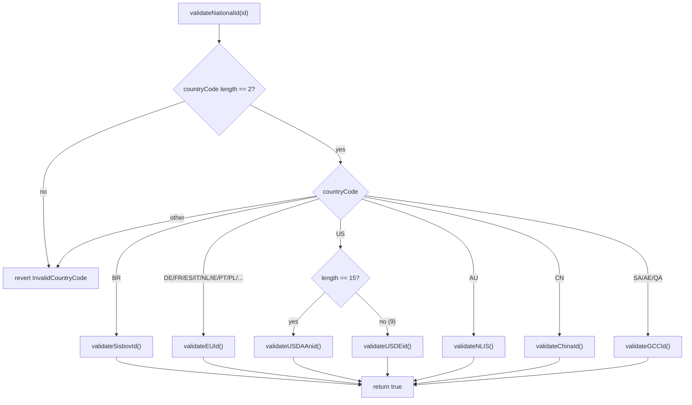

# Global Livestock Identification Systems

## Overview

The `ranch_ledger` project supports all major national bovine identification systems through a unified on-chain data model. This document provides a comprehensive reference for each system, including format specifications, validation rules, and on-chain validator functions.

All validators are implemented as `internal pure` functions in [`EUDRCompliance.sol`](../src/EUDRCompliance.sol) and are dispatched by a single `validateNationalId()` entry point based on the ISO 3166-1 alpha-2 country code.

## Unified Data Model

Every bovine registered on-chain carries a three-field identification triple that is consistent across all jurisdictions:

| Field          | Type      | Description                                                        |
| -------------- | --------- | ------------------------------------------------------------------ |
| `countryCode`  | `string`  | ISO 3166-1 alpha-2 country code (`BR`, `DE`, `US`, `AU`, `CN`, `SA`, `AE`, `QA`, …) |
| `nationalId`   | `string`  | Country-specific national livestock ID in its native format        |
| `earTag`       | `string`  | Physical ear tag number (human-readable, jurisdiction-defined)     |
| `timestamp`    | `uint256` | Unix timestamp when the ID was registered / anchored on-chain      |

The on-chain representation is the `NationalLivestockId` struct, defined in [`EUDRCompliance.sol`](../src/EUDRCompliance.sol):

```solidity
struct NationalLivestockId {
    string countryCode;        // ISO 3166-1 alpha-2: BR, EU, US, AU, CN, SA, AE, QA, etc.
    string nationalId;         // Country-specific ID (format varies by country)
    string earTag;             // Physical ear tag number (human-readable)
    uint256 timestamp;         // When this ID was registered/anchored on-chain
}
```

This single struct is reused by `BovineTracking.sol`, `EUDRCompliance.sol`, and `RanchLendingVault.sol`, so a bovine can move across contracts and jurisdictions without re-encoding its identity.

## Country Systems

### Brazil — SISBOV

| Attribute     | Value                                                                 |
| ------------- | --------------------------------------------------------------------- |
| **System**    | Sistema de Identificação e Certificação de Origem Bovina              |
| **Format**    | 15-digit numeric                                                      |
| **Example**   | `123456789012345`                                                     |
| **Validator** | `validateSisbovId()` — checks exactly 15 chars, all digits            |
| **Constant**  | `MIN_SISBOV_LENGTH = 15`                                              |
| **Regulator** | Ministério da Agricultura, Pecuária e Abastecimento (MAPA)           |

**Context:** Mandatory for all cattle in Brazil since 2002. Required for EU export compliance under the EUDR. The SISBOV number is the primary key used by MAPA to trace an animal from birth to slaughter, and it is the field that `EUDRMetadata.sisbovId` stores for legacy EUDR attestations.

### European Union — ISO 11784/11785

| Attribute      | Value                                                              |
| -------------- | ------------------------------------------------------------------ |
| **System**     | Radio-frequency identification of animals                          |
| **Format**     | `CC` + HerdMark (up to 6 chars) + Individual (up to 3 digits)      |
| **Example**    | `DE12ABCD004` (9 chars) to `DE12ABCDEF004` (12 chars)              |
| **Validator**  | `validateEUId()` — checks 9–12 chars, first 2 are letters (country code), last 3 are digits |
| **Constants**  | `MIN_EU_ID_LENGTH = 9`, `MAX_EU_ID_LENGTH = 12`                    |
| **Standard**   | ISO 11784 (code structure) + ISO 11785 (technical concept)         |

**Context:** Used across all EU member states for individual animal identification. The first 2 chars are the ISO 3166-1 alpha-2 country code of the member state that issued the tag (e.g. `DE`, `FR`, `ES`, `IT`, `NL`, `IE`, `PT`, `PL`). The validator is country-agnostic — any 2-letter EU country code prefix passes the letter check, and the dispatcher routes all EU member-state codes to `validateEUId()`.

### United States — USDA ANID

| Attribute     | Value                                                              |
| ------------- | ------------------------------------------------------------------ |
| **System**    | Animal Identification Number (840 prefix)                          |
| **Format**    | 15-digit numeric                                                   |
| **Example**   | `840123456789012`                                                  |
| **Validator** | `validateUSDAAnid()` — checks exactly 15 chars, all digits         |
| **Constant**  | `MIN_USD_ANID_LENGTH = 15`                                         |
| **Regulator**  | United States Department of Agriculture (USDA)                    |

**Context:** Official identification number for livestock in the USA. The `840` prefix indicates US origin and is part of the official USDA Animal Disease Traceability framework. The 15-digit format aligns with ISO 11784 so that US-tagged animals are readable by international ISO 11785 RFID readers.

### United States — USDA EID

| Attribute     | Value                                                          |
| ------------- | -------------------------------------------------------------- |
| **System**    | Electronic Identification Number                                |
| **Format**    | 9-digit numeric                                                |
| **Example**   | `123456789`                                                    |
| **Validator** | `validateUSDEid()` — checks exactly 9 chars, all digits        |
| **Constant**  | `MIN_USD_EID_LENGTH = 9`                                       |

**Context:** Shorter electronic ID format used for RFID ear tags in the USA. The dispatcher selects between ANID and EID based on the length of the submitted `nationalId` (15 → ANID, 9 → EID).

### Australia — NLIS

| Attribute     | Value                                                          |
| ------------- | -------------------------------------------------------------- |
| **System**    | National Livestock Identification System                       |
| **Format**    | 12-digit DUNS-based (Data Universal Numbering System)         |
| **Example**   | `123456789012`                                                 |
| **Validator** | `validateNLIS()` — checks exactly 12 chars, all digits        |
| **Constant**  | `MIN_NLIS_LENGTH = 12`                                         |
| **Regulator** | Meat & Livestock Australia (MLA)                               |

**Context:** Mandatory for all cattle movements in Australia. The PIC (Property Identification Code) of the property of birth is embedded in the number, which allows NLIS to trace an animal back to its origin property without an external lookup.

### China — MARA

| Attribute     | Value                                                              |
| ------------- | ------------------------------------------------------------------ |
| **System**    | Ministry of Agriculture and Rural Affairs identification           |
| **Format**    | 15-digit numeric (follows ISO 11784/11785)                         |
| **Example**   | `123456789012345`                                                  |
| **Validator** | `validateChinaId()` — checks exactly 15 chars, all digits          |
| **Constant**  | `MIN_CHINA_ID_LENGTH = 15`                                         |
| **Regulator** | 农业农村部 (Ministry of Agriculture and Rural Affairs)            |

**Context:** China's national livestock identification system, aligned with international ISO standards. The 15-digit length matches ISO 11784 so Chinese-tagged cattle are interoperable with EU and USDA readers.

### GCC — GSO 2057:2016

| Attribute      | Value                                                                  |
| -------------- | ---------------------------------------------------------------------- |
| **System**     | Gulf Standardization Organization standard for animal identification   |
| **Format**     | `CC-XXXXXX-XXXX` (country code + farm number + individual number)     |
| **Example**    | `SA-001234-5678`                                                       |
| **Validator**  | `validateGCCId()` — checks exactly 14 chars, format `XX-XXXXXX-XXXX`, first 2 letters, digits between separators |
| **Constant**   | `MIN_GCC_ID_LENGTH = 14`                                              |
| **Countries**  | Saudi Arabia (`SA`), United Arab Emirates (`AE`), Qatar (`QA`)        |
| **Regulator**  | Gulf Standardization Organization (GSO)                               |

**Context:** Regional standard for GCC member states. The first 2 chars are the ISO 3166-1 alpha-2 country code. The dispatcher routes `SA`, `AE`, and `QA` to the same `validateGCCId()` validator.

## Validation Pipeline

All on-chain ID validation flows through a single dispatcher, `validateNationalId(NationalLivestockId memory id)`, defined in [`EUDRCompliance.sol`](../src/EUDRCompliance.sol). The pipeline is:



1. **Country-code check** — `countryCode` must be exactly 2 characters; otherwise `revert InvalidCountryCode`.
2. **Dispatch** — route to the country-specific validator based on `countryCode`:
   - `"BR"` → `validateSisbovId()`
   - `"DE"`, `"FR"`, `"ES"`, `"IT"`, `"NL"`, `"IE"`, `"PT"`, `"PL"`, … → `validateEUId()`
   - `"US"` → `validateUSDAAnid()` (15 chars) or `validateUSDEid()` (9 chars), selected by length
   - `"AU"` → `validateNLIS()`
   - `"CN"` → `validateChinaId()`
   - `"SA"`, `"AE"`, `"QA"` → `validateGCCId()`
3. **Result** — each validator returns `true` on success or `revert InvalidNationalId(nationalId, reason)` with a human-readable reason string on failure.

## On-chain Integration

The unified ID model is consumed by three core contracts:

- **[`BovineTracking.sol`](../src/BovineTracking.sol)** — the `Bovine` struct carries `countryCode`, `nationalId`, and `earTag` fields, so every animal is identifiable by its national ID at the tracking layer.
- **[`EUDRCompliance.sol`](../src/EUDRCompliance.sol)** — defines the `NationalLivestockId` struct and all country-specific validators, plus the `validateNationalId()` dispatcher. Used for EUDR attestation and cross-jurisdiction ID checks.
- **[`RanchLendingVault.sol`](../src/RanchLendingVault.sol)** — the `Collateral` struct carries `countryCode` and `nationalId`, enabling cross-jurisdiction collateral acceptance and validation against the same set of validators.

## Competitive Advantage

No open-source EVM tool currently provides on-chain validators for all of these systems simultaneously. The combination of SISBOV, EU ISO 11784/11785, USDA ANID/EID, Australian NLIS, Chinese MARA, and GCC GSO 2057 in a single dispatcher is a key differentiator for `ranch_ledger`. See [`docs/COMPETITORS.md`](./COMPETITORS.md) §5 for the feature-gap matrix comparing this coverage against other on-chain livestock traceability projects.

## Adding New Country Support

To add a new country's livestock ID system:

1. **Add constants** — define `MIN_XXX_LENGTH` (and `MAX_XXX_LENGTH` if variable-length) in [`EUDRCompliance.sol`](../src/EUDRCompliance.sol).
2. **Write the validator** — add an `internal pure` function `validateXXXId(string memory id)` that checks length and character classes, reverting with `InvalidNationalId` on failure.
3. **Wire the dispatcher** — add a new `else if` branch to `validateNationalId()` matching the country's ISO 3166-1 alpha-2 code.
4. **Update this document** — add a new section under [Country Systems](#country-systems) with the format, example, validator name, constants, regulator, and context.
5. **Add test cases** — cover valid examples, invalid-length, and invalid-character cases in the test suite.